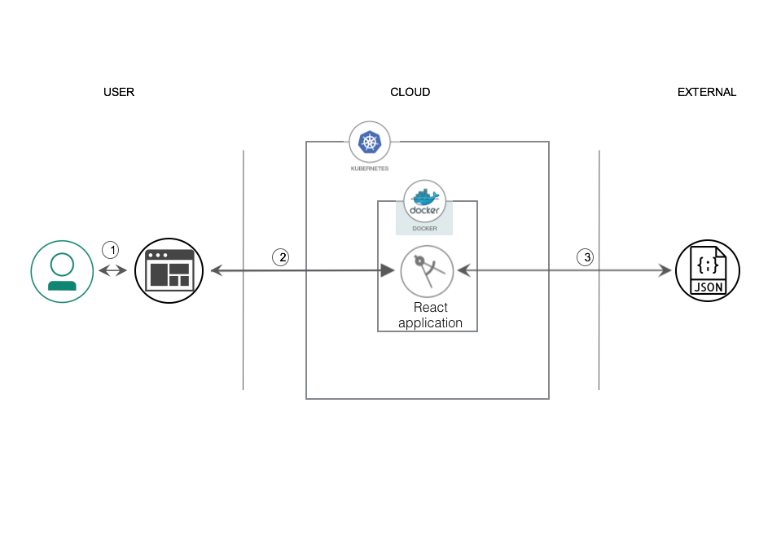

[](https://travis-ci.org/IBM/deploy-react-kubernetes)

# Deploy a React application on Kubernetes

In this Code Pattern, we will deploy a React application using Kubernetes.

There are many choices when looking for the right solution to manage and deploy our applications. It can often be overwhelming when we're trying to pick the right solution. One of our many choices is Kubernetes. This pattern will take you through how to get a front end application deployed on Kubernetes. After implementing the code, you will have the knowledge to deploy your own applications on Kubernetes. 

This repository uses the React JavaScript library to build out the front end of the application. Redux is a predictable state container used hand in hand with React. It handles all of the state management within the application. The OMDb API is called to get movie information based on user input. Docker is an open source tool that is used to package the application into a container. IBM Cloud provides one to use with Kubernetes deployments called IBM Cloud Container Service. Kubernetes handles the management and deployment of the containerized application.

When the reader has completed this Code Pattern, they will understand how to:
* Containerize a React application using Docker
* Deploy and manage an application using Kubernetes

## Flow



1. The user accesses the application through the web interface. The user enters a movie title into the input.  
2. The React application is rendered to the user on access.
3. The application calls the OMDb API and receives a JSON object of the response to show the user.

## Included components
* IBM Cloud Container Service: IBM Bluemix Container Service manages highly available apps inside Docker containers and Kubernetes clusters on the IBM Cloud.
* Kubernetes Cluster: Create and manage your own cloud infrastructure and use Kubernetes as your container orchestration engine.

## Featured technologies
* Node.js: An open-source JavaScript run-time environment for executing server-side JavaScript code.
* Cloud: Accessing computer and information technology resources through the Internet.
* Container Orchestration: Automating the deployment, scaling and management of containerized applications.

# Watch the video

# Steps

## Prerequisites
1. You must get an API key from [OMDb API](http://www.omdbapi.com/) in order to get a response from the API. You will insert your API key in /src/actions/index.js on line 42
[OMDb API](http://www.omdbapi.com/) by Brian Fitz is licensed under [CC BY-NC 4.0](https://creativecommons.org/licenses/by-nc/4.0/)

2. Create an environment variable for your docker username
```
$ export docker_username="YOUR_DOCKER_USERNAME"
```

## Run locally
1. [Clone the repo](#1-clone-the-repo)
2. [Run the application](#2-run-the-application)

### 1. Clone the repo

Clone the repo locally. In a terminal, run:

```
$ git clone https://github.com/IBM/deploy-react-kubernetes
```

### 2. Run the application
1. Install [Node.js](https://nodejs.org/en/)
2. Run the following commands in a terminal: 

```
$ npm install

$ npm run build-css

$ npm run start
```

## Run the application using Docker
1. [Build the image](#1-build-the-image)
2. [Run the image](#2-run-the-image)

### 1. Build the image

In a terminal, run:
```
$ docker build -t $docker_username/deploy-react-kubernetes .
```

Your image should be listed by running:

```
$ docker images
```

### 1. Run the image

In a terminal, run:

```
$ docker run -p 3000:3000 -d $docker_username/deploy-react-kubernetes
```

You can now access the application at http://localhost:3000

### 2. Run the application on Kubernetes

1. [Build Docker image.](#1-build-docker-image)
2. [Deploy the application](#2-deploy-the-application)

## Prerequisites
* Create a namespace 
```
$ bx cr namespace-add <your_namespace>
```

### 1. Build Docker image

In a terminal, run:
```
$ bx cr build -t registry.<ibm_cloud_region>.bluemix.net/<your_namespace>/deploy-react-kubernetes .
```

### 2. Deploy the application

``` 
$ kubectl run deploy-react-kubernetes-deployment —-image= registry.<ibm_cloud_region>.bluemix.net/<your_namespace>/deploy-react-kubernetes

$ kubectl expose deployment/deploy-react-kubernetes-deployment 
—-type=NodePort —-name=deploy-react-kubernetes-service —-port=3000
```

* To access your application. You would need the public IP address of your cluster and NodePort of the service.

```
# For clusters provisioned with IBM Cloud
$ bx cs workers YOUR_CLUSTER_NAME
```

```
# For details on a specific Kubernetes service
$ kubectl describe service deploy-react-kubernetes-service
```

You can now access the application at http://IP_ADDRESS:NODE_PORT

# Sample output


# Links
* [Demo on Youtube](https://www.youtube.com/watch?v=Jxi7U7VOMYg)
* [Blog post](https://medium.com/@rizchel.a.dayao/my-journey-to-deploying-my-first-react-application-with-kubernetes-95e6d25f434d)

# Learn more

* **Container Orchestration Code Patterns**: Enjoyed this Code Pattern? Check out our other [Container Orchestration Code Patterns](https://developer.ibm.com/code/technologies/container-orchestration/).
* **Kubernetes on IBM Cloud**: Deliver your apps with the combined the power of [Kubernetes and Docker on IBM Cloud](https://www.ibm.com/cloud-computing/bluemix/containers)

# License
[Apache 2.0](LICENSE)
